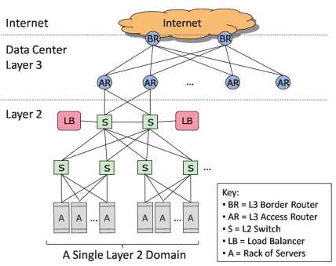

[@greenberg2008cost]

# Infraestructura

## Componentes

- Sistema de Alimentación Ininterrumpida (SAI)
- Sistema de enfriamiento

## Reducción del Costo

- Relajar el requerimiento de alimentación ininterrumpida
- Varios Data Centers baratos

# Consumo Energético

_Power Usage Efficiency_ (PUE)

: $PUE = \frac{ Consumo Energetico Total }{ Consumo Energetico IT }$

    Eficiencia del consumo energético.

## Propuesta

- Ahorrar en enfriamiento

# Red

## Costos

- Equipamiento
- Red de Area Amplia
    + _peering_
    + enlaces entre data centers

## Reducción de costos

- Estrategias de _peering_
- Optimizar uso de la red

# Geo-Distribucion

- Diversidad geografica [@kohavi2007practical]
- Mega/micro data centers
- Coste de red

# Conclusiones

- Relacion coste/utilización
- Uso de la red
- Geo-diversificacion

## Propiedades Necesarias

- Direccionamiento independiente de ubicación
- Ancho de banda y latencia uniformes
- Seguridad

# Bibliografía
